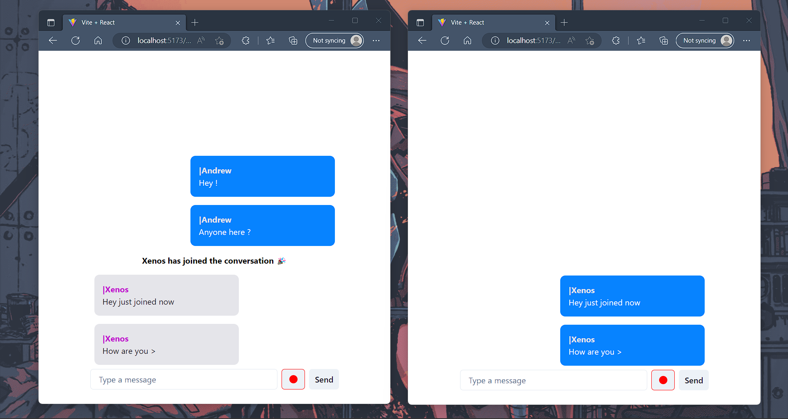

# A Simple React Chat App

## Tech Stack
- React + Vite
- Socket.io
- Chakra UI
- Randomcolor

## Todo 
- [ ] Message chat when user exits
- [ ] Add a image/emoji button
- [ ] Add a minimal backend for chat save (optional for now)
- [ ] Make the app a bit more scalable incase user registration is added in the future